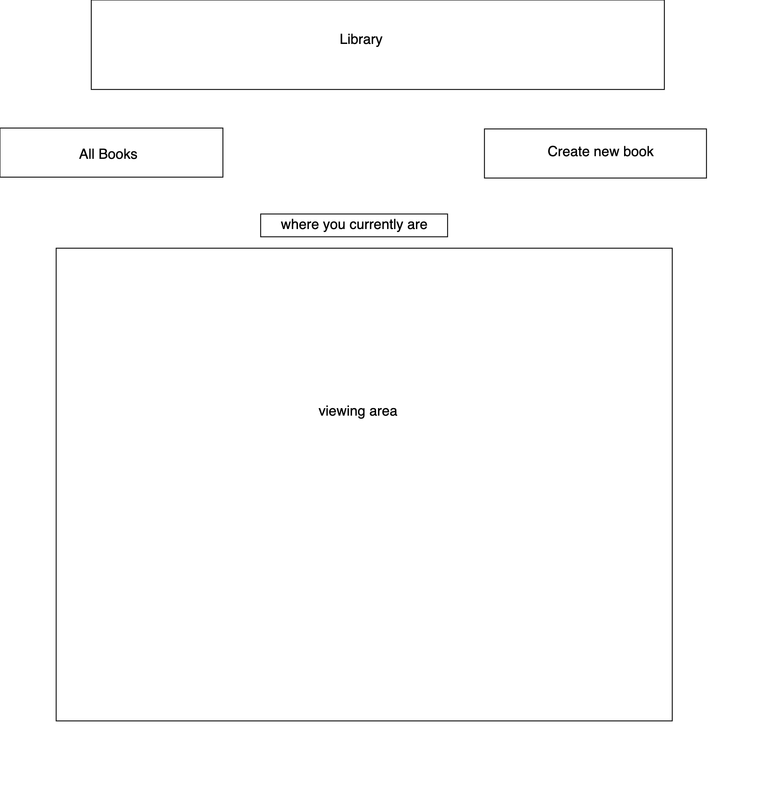

# Team Avatar
## Using Our Library
Start by taking a look at an index of all of our books by pressing the 'All Books' button. From there you may select any of the existing books to view their details or press 'Create a new book' to add your own. If you would like to delete a book to make room for more, you may do so by selecting the book you want to delete and pressing the 'Delete' button. While viewing the details of a book, you may edit the details by pressing the 'Edit' button and submitting your changes. Knowledge is power!
## Wireframe
General layout for the site

## User Stories
1. When I load the site, I see links to "All Books" and "Create a New Book". I also see a header (under the links) identifying which view I'm currently in, and a viewing area. The header starts off as "Index of All Books", and the viewing area starts off with a list of all existing books.
2. Each book in the list displays just the book's title.
3. When I click on a single book in the list, the header changes to "Details for {book title}", and the viewing area changes to the full details for that book.
4. When I click on "Create a New Book", the header changes to "New Book Details", and the viewing area changes to a form. The form contains a labelled input for each attribute of the book (as required by the API).
5. When I submit the new book, I see the details page for the book I just created (including an updated header and viewing area).
6. When I am in "Details for {book title}" view, there is a Delete button underneath the book's details. When I click this button, the book gets deleted from the API, and the view changes to the List of All Books.
7. When I am in "Details for {book title}" view, there is an Edit button underneath the book's details. When I click this button, the header changes to "Editing {book-title}", and the viewing area changes to a form. The fields of the form are pre-filled with the book's attributes. When I submit this form, the book gets updated in the API, and my view changes to the Details page for the book I just updated.
## MVP Goals
1. Fetch the api and console.log the response
2. Create html/css layout
3. Create div for each book
4. update div info with with book's data
5. Add event listeners to all the divs
6. Add a function to display the details of each and this will be attached to the event listener.
7. Add create a new book button and show the form onclick
8. Post to the API with a new book info.
9. Get the new book info.
## Stretch Goals
- Add delete & edit buttons
- Add form validations with messages
- Make it pretty!
- Add loading wheel